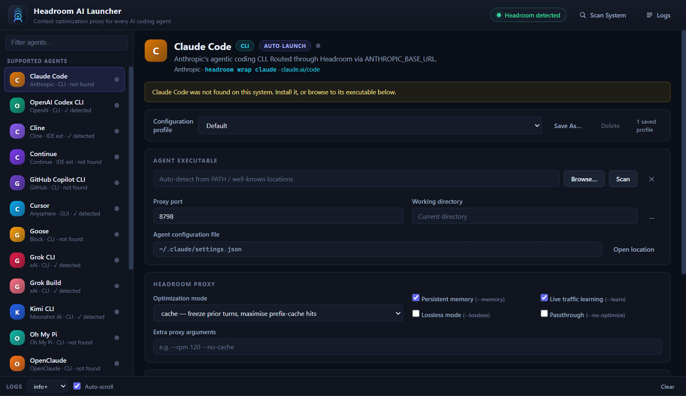

# TokenZero - Studio

A professional, zero-setup desktop GUI for connecting your pre-installed AI coding agents to token cost optimization proxies (**Headroom**, **RTK**, **PxPipe**, **LLMLingua**, **LiteLLM**, **Custom**).

TokenZero - Studio wraps your pre-installed AI coding agents to compress context and cut token spend across all major providers.



---

## How it Differs from 9Router & OmniRouter

Unlike projects such as **9Router** or **OmniRouter** (which act as complex API routers, LLM load balancers, or model gateway proxies requiring central server setups and API key routing configurations):

- **Zero Setup & Zero Extra Downloads**: TokenZero - Studio is **not an LLM router**. You do not need to configure complex cloud proxy routes or download router daemons.
- **Direct Local Launcher**: It is a lightweight desktop wrapper that detects **already pre-installed Coding Agents** on your system.
- **Instant Proxy Binding**: It seamlessly attaches local token cost optimizers (**Headroom**, **RTK**, **PxPipe**, **LLMLingua**, **LiteLLM**, or any **Custom** proxy) to your agent's API environment (`OPENAI_BASE_URL` / `ANTHROPIC_BASE_URL`) and launches the agent in a single click.

---

## Supported AI Coding Agents

TokenZero - Studio supports 18 pre-installed AI coding agents:

- **Aider** — AI pair programming in your terminal
- **Claude Code** — Anthropic's agentic coding CLI
- **Cline** — Autonomous coding agent (VS Code extension / CLI)
- **Continue** — Open-source AI code assistant
- **Cursor** — AI-powered code editor
- **GitHub Copilot CLI** — GitHub Copilot command-line interface
- **Goose** — Open-source AI developer agent
- **Grok CLI** — xAI Grok command-line agent
- **Grok Build** — Grok project builder assistant
- **Kimi CLI** — Moonshot AI Kimi coding agent
- **Mistral Vibe** — Mistral AI coding assistant
- **Oh My Pi** — Interactive terminal AI coding assistant
- **OpenClaude** — Open-source Claude API agent CLI
- **OpenClaw** — Open-source autonomous coding agent
- **OpenCode** — AI terminal code generator
- **OpenHands** — Open-source software development agent
- **OpenAI Codex CLI** — OpenAI Codex agent CLI
- **ZCode** — Intelligent desktop coding workspace

---

## Features

- **Multiple Token Cost Optimizers** — Headroom (`pip install headroom-ai`), RTK (`brew install rtk`), PxPipe (`npx pxpipe-proxy`), LLMLingua (`pip install llmlingua`), LiteLLM (`pip install litellm`), and Custom proxies.
- **Auto-detection** — Scans `PATH` and well-known install locations for both agents and proxy binaries.
- **Saved Profiles** — Per-agent and per-proxy named configurations (path, port, mode, flags, extra args, env overrides, working directory).
- **Per-Agent Ports** — Unique default ports so several agents run at once; live port-check and port-kill tools.

---

## Requirements

- [Node.js](https://nodejs.org/) 18+ (for development)
- One of the supported token cost optimizers:
  - **Headroom** (`pip install headroom-ai`)
  - **PxPipe** (`npx pxpipe-proxy`)
  - **RTK** (`brew install rtk` or curl installer)
  - **LLMLingua** (`pip install llmlingua`)
  - **LiteLLM** (`pip install litellm`)
  - **Custom** local proxy binary
- One or more of the supported AI agents pre-installed on your system.

---

## Quick Start

### One-Click Build & Run (All Platforms)

- **Linux / macOS / Git Bash / WSL**:
  ```bash
  chmod +x build_and_run.sh
  ./build_and_run.sh
  ```

- **Windows (Command Prompt / PowerShell)**:
  ```cmd
  build_and_run.bat
  ```

### Manual Quick Start

```bash
git clone https://github.com/haseeb-heaven/token-zero-studio.git
cd token-zero-studio
npm install
npm run build     # bundles the Electron main, preload and renderer
npm start         # launches the app
```

### Development

```bash
npm run dev       # build and launch Electron
npm test          # run the unit-test suite
```

---

## How It Works

1. The launcher starts your chosen token cost optimizer (`headroom`, `rtk`, `pxpipe`, `llmlingua`, `litellm`, or `custom`) on its configured port.
2. It waits for the proxy to answer readiness checks.
3. It launches the selected pre-installed agent with `ANTHROPIC_BASE_URL` / `OPENAI_BASE_URL` pointing at the local proxy, so all API traffic is compressed and optimized.
4. For IDE-extension agents (e.g. Continue), it starts the proxy and displays manual configuration instructions.

---

## Configuration

Settings are persisted as JSON in the user data folder:

- **Windows**: `%APPDATA%\token-zero-studio/config.json`
- **macOS**: `~/Library/Application Support/token-zero-studio/config.json`
- **Linux**: `~/.config/token-zero-studio/config.json`

---

## Testing

```bash
npm test
```

---

## Contributing

See [CONTRIBUTING.md](CONTRIBUTING.md) for the development workflow and how to add new agents or proxies.

---

## License

MIT
